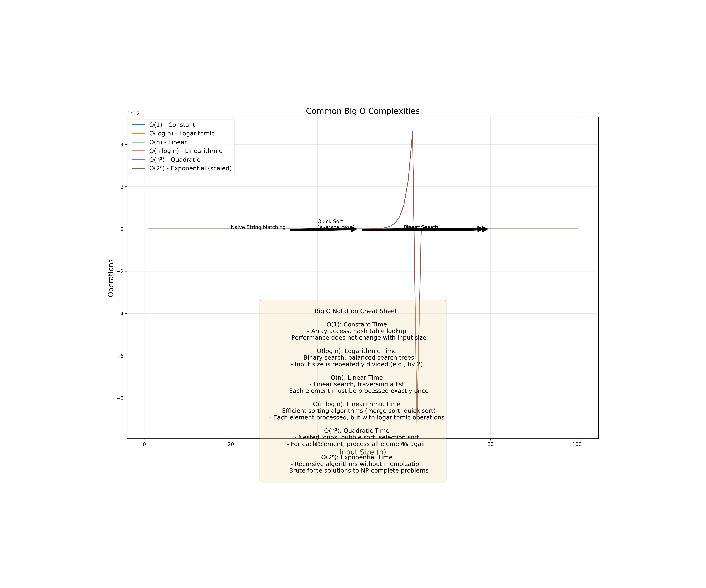
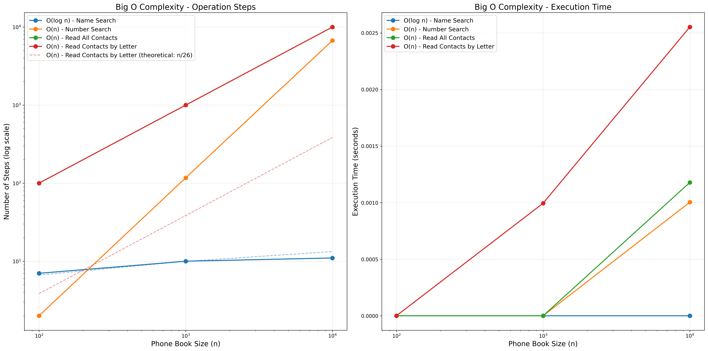
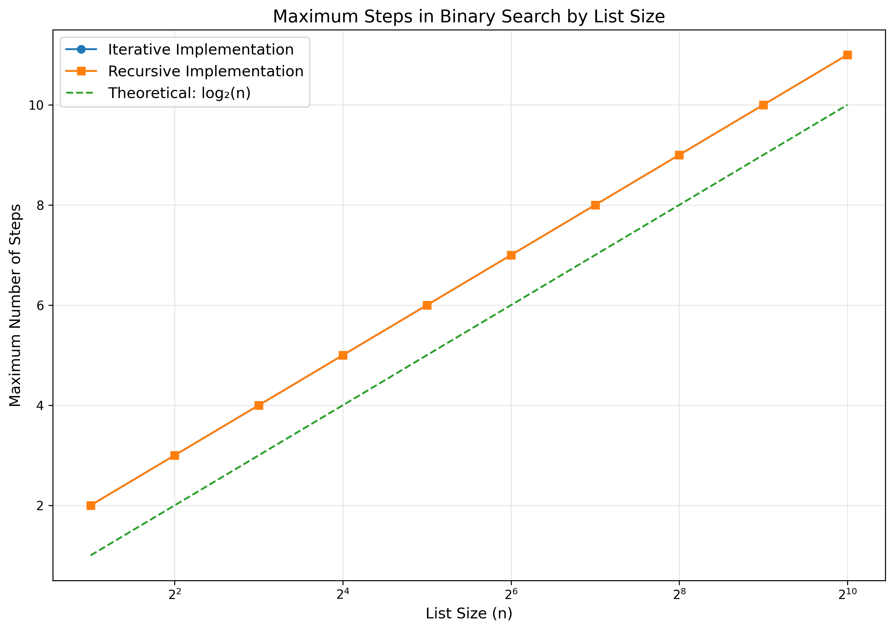
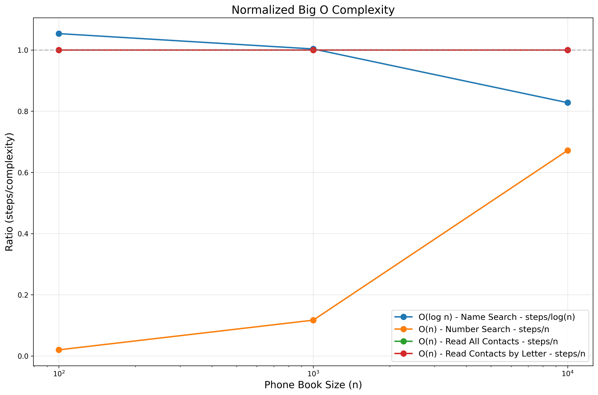

# Algorithm Experiments - Binary Search & Big O Analysis


<p align="center">
  
</p>

## 📚 Introduction

This repository contains a comprehensive set of experiments and visualizations for understanding fundamental algorithm concepts. The current implementation focuses on exploring binary search and Big O notation from Chapter 1 of "Grokking Algorithms" by Aditya Bhargava.

### What's inside?

- ✅ **Interactive binary search algorithm** implementation with step tracking
- ✅ **Visual complexity analysis** of various algorithms
- ✅ **Phone book simulation** demonstrating practical applications
- ✅ **Big O cheat sheet** that brings theory to life

## 🔍 Key Concepts Explored

### 1. Binary Search

Binary search is a fundamental divide-and-conquer algorithm used to find an item in a sorted list. The repository includes both iterative and recursive implementations with detailed step counts to demonstrate the logarithmic complexity.

```python
# Binary search with step counting
def binary_search(sorted_list, item):
    low = 0
    high = len(sorted_list) - 1
    steps = 0
    
    while low <= high:
        steps += 1
        mid = (low + high) // 2
        guess = sorted_list[mid]
        
        if guess == item:
            return mid, steps
        elif guess > item:
            high = mid - 1
        else:
            low = mid + 1
            
    return -1, steps
```

### 2. Big O Notation Analysis

The repository explores various time complexities:

- **O(log n)** - Binary search operations
- **O(n)** - Linear search operations
- **O(n²)**, **O(n log n)**, etc. - Visualization of other complexities

<p align="center">
  
</p>

<p align="center">
  
</p>

<p align="center">
  
</p>

### 3. Questions Addressed

#### Problem 1.1 & 1.2: Maximum Steps in Binary Search
- For a sorted list of 128 names: maximum of 8 steps
- For a sorted list of 256 names: maximum of 9 steps

#### Problems 1.3-1.6: Big O Notation
- Finding a phone number by name in a phone book: O(log n)
- Finding a name by phone number: O(n)
- Reading all entries in a phone book: O(n)
- Reading just entries starting with a specific letter: O(n)

The repository includes visualizations that demonstrate these concepts empirically.

## 🚀 Installation & Usage

1. Clone the repository:
   ```bash
   git clone https://github.com/peter1998/AlgorithmExperiments.git
   cd AlgorithmExperiments
   ```

2. Install required dependencies:
   ```bash
   pip install matplotlib numpy tqdm
   ```

3. Run the experiments:
   ```bash
   python binary_search_experiments.py
   ```

4. Examine the generated visualizations in the project folder.

## 📊 Visualizations

The code generates several visualizations:

1. **Binary Search Steps:** Shows the relationship between list size and number of steps
   <details>
   <summary>View Binary Search Steps Graph</summary>
   
   </details>

2. **Big O Complexity Analysis:** Compares different operations across various input sizes
   <details>
   <summary>View Big O Complexity Graph</summary>
   
   </details>

3. **Normalized Complexity:** Illustrates how operations scale relative to their theoretical complexity
   <details>
   <summary>View Normalized Complexity Graph</summary>
   
   </details>

4. **Big O Cheat Sheet:** Provides a visual guide to common algorithmic complexities
   <details>
   <summary>View Big O Cheat Sheet</summary>
   
   </details>

## 📈 Key Findings

The experimental results clearly demonstrate the following:

1. **Binary search achieves O(log n) complexity:**
   - For a list with 1024 elements, only 11 steps are needed
   - Recursive and iterative implementations show identical performance

2. **Phone Book operations confirm theoretical complexities:**
   - Name search (binary search): O(log n) - Extremely efficient as dataset grows
   - Number search (linear search): O(n) - Performance degrades linearly with dataset size
   - Full data reading: O(n) - Scale directly with input size

3. **Real-world implications:**
   - Logarithmic algorithms remain efficient even with extremely large datasets
   - Linear algorithms become impractical with very large datasets
   - Data structure selection dramatically impacts application performance

## 💻 Sample Output

```
===============================================================================
Binary Search and Big O Notation Experiments
===============================================================================

Experiment: Maximum Steps in Binary Search
------------------------------------------------------------
Maximum steps for list with 128 elements: 8
Maximum steps for list with 256 elements: 9
Theoretical formula: log₂(n) steps for n elements
log₂(128) = 7, log₂(256) = 8
Recursive implementation - 128 elements: 8 steps
Recursive implementation - 256 elements: 9 steps
```

## 🔮 Future Work

The following features are planned for future updates:

- [ ] Implement and visualize sorting algorithms (Chapter 2)
- [ ] Add recursion examples and complexity analysis (Chapter 3)
- [ ] Include divide-and-conquer algorithm demonstrations (Chapter 4)
- [ ] Add interactive Jupyter notebook tutorials
- [ ] Create a web interface for algorithm visualization

## 🤝 Contributing

Contributions are welcome! Please feel free to submit a Pull Request.

1. Fork the repository
2. Create your feature branch (`git checkout -b feature/amazing-feature`)
3. Commit your changes (`git commit -m 'Add some amazing feature'`)
4. Push to the branch (`git push origin feature/amazing-feature`)
5. Open a Pull Request

## 📄 License

This project is licensed under the MIT License - see the [LICENSE](LICENSE) file for details.

## 📚 References

- Bhargava, A. (2016). *Grokking Algorithms: An illustrated guide for programmers and other curious people*. Manning Publications.
- Cormen, T. H., Leiserson, C. E., Rivest, R. L., & Stein, C. (2009). *Introduction to Algorithms* (3rd ed.). MIT Press.

---

<p align="center">
  <i>If you found this repository helpful, please consider giving it a star! ⭐</i>
</p>
